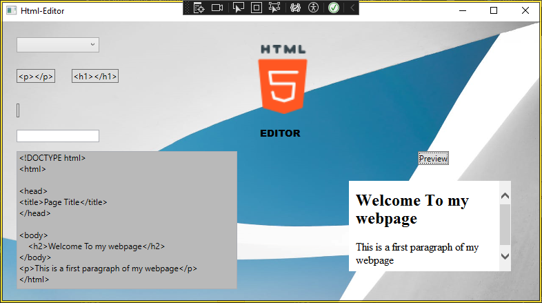

Project keywords: C#, WPF, Drag and Drop, SQLite

ABOUT THE APPLICATION

A Windows Presentation Foundation-based desktop application that helps the user create HTML and CSS files. The user can use the radio buttons to choose whether the program generates HTML or CSS boilerplate code. The application supports C# drag and drop and provides ready-made HTML or CSS tags in Button elements. These tags can be dragged and dropped into a TextBox element where the HTML page is written. Button elements contain either HTML or CSS tags depending on which the user has selected.

Users can also create their own HTML elements by typing them into the TextField input field. After typing, the element is generated in its own button element and can be dragged and dropped into the TextBox element. The user can also use keyboard shortcuts to create and insert HTML tags in the editing view.

HTML TAGS SHORTCUTS

For now, the application supports adding single-letter HTML tags using keyboard shortcuts.
For example, Control+p will add a p tag to the position in the editing view where the cursor is. The application determines the cursor position using the CaretIndex property in C#.
(https://learn.microsoft.com/en-us/dotnet/api/system.windows.controls.textbox.caretindex?view=windowsdesktop-9.0). Keyboard bindings are done with C# WPF KeyDown events.

AUTOCOMPLETE TEXT

The user can also utilize automatic text completion when writing html tags. This feature can be enabled by clicking the checkbox.
When the feature is selected, the application's UI displays an autocomplete box element to the user. The autocomplete functionality
is implemented using the DotNetProjects.WpfToolkit.Input library. (https://www.nuget.org/packages/DotNetProjects.WpfToolkit.Input/).
The suggested HTML tags are loaded from a text file used by the application based on the user's input.

Example image of the auto-fill feature in use

SIZING & RESPONSIVE FEATURES

Both the edit and preview windows can be resized. The edit window can be resized by clicking the plus or minus button. Each click changes the width and height of the window by 5 pixels. The preview window can be resized using the WPF slider component.

When the user increases or decreases the size of the text box, the button elements in the UI react to the size changes. When the size increases, the button elements move horizontally 5 pixels to the right per click, and when the size decreases, they move horizontally 5 pixels to the left.

SAVE THE SIZE DEFINITION

The application uses a SQLite database where the user can store the width and height of the text box and retrieve the values ​​later. The values ​​are stored as a real data type, and if the user retrieves the stored values, they are passed as parameters to the width and height properties of the text box. After passing the values, the application resizes the text box to match the values ​​retrieved from the database.

SAVE AND LOAD FILE

The application uses C#'s FileDialog and File classes to save and load files.

WEBSITE PREVIEW

The user can preview a website under construction or another HTML file of their choice. The application uses the C# browser library to display the HTML content. The web browser view is embedded in the same UI.

By default, the function opens the HTML file that the user has saved for display, but the user can also select another HTML file to display by clicking the checkbox and then pressing the "preview" button. The checkbox and button open a file selection dialog from which the user can browse to the HTML file they want to display. See the example image below.

