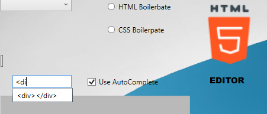
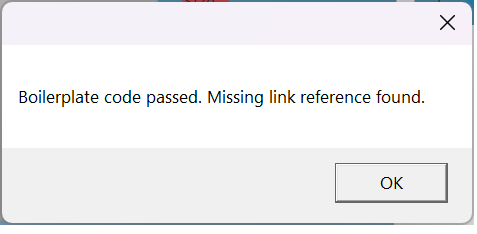
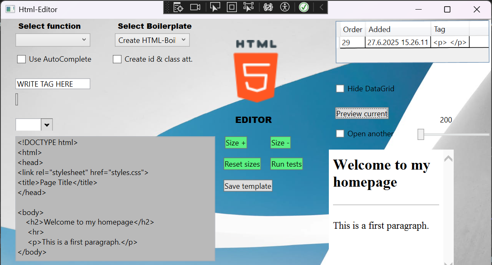

Project keywords: C#, WPF, Drag and Drop, SQLite, Keyboard Bindings, WPF Toolkit

ABOUT THE APPLICATION

A Windows Presentation Foundation-based desktop application that helps and speeds up the creation of HTML and CSS files. The application provides the user with, for example, a comprehensive selection of ready-made HTML basic codes for forms and tables stored in a SQL database that can be retrieved with a mouse click, keyboard shortcuts to speed up the creation of HTML tags, drag-and-drop features, and automatically generated HTML attributes for HTML tags.

HTML TAGS SHORTCUTS

The application supports adding HTML tags using keyboard shortcuts.
Single-character tags can be added using the key combination Ctrl + the letter of the tag.
For example, Ctrl+P adds a p tag to the position where the cursor is in the editing view.
Multi-character tags are added using the key combination Shift + the first letter of the tag. For example, Shift + D adds a div tag to the position where the cursor is in the editing view.

The keyboard shortcuts are stored in the SQL database as text and when retrieved, the text is converted to a C# key data type using the Enum.TryParse method.

The application determines the cursor position using the C# CaretIndex property.
(https://learn.microsoft.com/en-us/dotnet/api/system.windows.controls.textbox.caretindex?view=windowsdesktop-9.0). Keyboard bindings are done using the C# WPF KeyDown and KeyUp events.

DRAG AND DROP TAGS & AUTOCOMPLETE TEXT

The user can enter HTML and CSS tags using the input field. When the tag is entered, a lost focus event occurs in the input field, which moves the entered tag to the button element.
From the button event, the user can drag and drop the tag into the text box element.
This feature is implemented using the C# Dran And Drop class.

The user can also utilize automatic text completion when writing html tags. This feature can be enabled by clicking the checkbox. When the feature is selected, the application's UI displays an autocomplete box element to the user. The autocomplete functionality is implemented using the DotNetProjects.WpfToolkit.Input library. (https://www.nuget.org/packages/DotNetProjects.WpfToolkit.Input/).The suggested HTML tags are loaded from a SQLite database used by the application based on the user's input.

Example image of the auto-fill feature in use

AUTOMATIC CREATION OF HTML ATTRIBUTES

The user can select the "Create ID and class attributes" checkbox if they want id, class, and name attributes to be automatically created for HTML tags. The automatically created attributes are in the format YourID1, YourID2, etc. The variable number at the end of the attribute name ensures that each html id is unique.

AUTOMATIC GENERATION OF MORE COMPLEX HTML TEMPLATES

The application uses an SQLite database to store the source code for more complex elements, such as HTML forms and tables. The user can import these standard codes into the editing view by selecting the correct option from the WPF ComboBox component.

DEBUGGING HTML

The application has HTML code testing methods that can be executed with the click of a button. Currently, the methods test that the HTML base code is written correctly, and another test checks for missing link references. Below is an example image where the application displays a message box stating that the HTML boilerplate code is accepted, but a missing link reference is found.

SIZING & RESPONSIVE FEATURES

Both the edit and preview windows can be resized. The edit window can be resized by clicking the plus or minus button. Each click changes the width and height of the window by 5 pixels. The preview window can be resized using the WPF slider component.

When the user increases or decreases the size of the text box, the button elements in the UI react to the size changes. When the size increases, the button elements move horizontally 5 pixels to the right per click, and when the size decreases, they move horizontally 5 pixels to the left.

SAVE THE SIZE DEFINITION

The application uses a SQLite database where the user can store the width and height of the text box and retrieve the values ​​later. The values ​​are stored as a real data type, and if the user retrieves the stored values, they are passed as parameters to the width and height properties of the text box. After passing the values, the application resizes the text box to match the values ​​retrieved from the database.

SAVE AND LOAD FILE

The application uses C#'s FileDialog and File classes to save and load files.

WEBSITE PREVIEW

The user can preview a website under construction or another HTML file of their choice. The application uses the C# browser library to display the HTML content. The web browser view is embedded in the same UI.

By default, the function opens the HTML file that the user has saved for display, but the user can also select another HTML file to display by clicking the checkbox and then pressing the "preview" button. The checkbox and button open a file selection dialog from which the user can browse to the HTML file they want to display. See the example image below.

